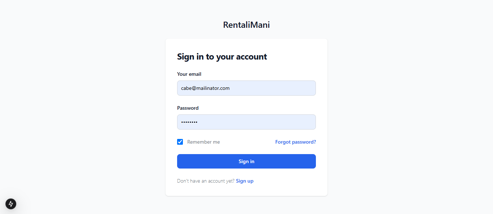

Sure! Here's a sample README file that documents the UI design based on your schema:

---

# Property Management System - UI Documentation

## Introduction

This document provides an overview of the user interface (UI) for the Property Management System. The system is designed to manage property owners, apartments, rental units, tenants, lease agreements, invoices, payments, and tenant transfers. It supports multiple relationships and ensures data integrity for smooth property management.

## Entities

1. **PropertyOwner**:
   - Manages multiple apartments.
   - Attributes: `id`, `name`, `email`, `phone`

2. **Apartment**:
   - Belongs to a property owner and contains multiple rental units.
   - Attributes: `id`, `owner_id`, `name`, `address`

3. **Unit**:
   - Represents an individual rental unit in an apartment.
   - Attributes: `id`, `apartment_id`, `unit_number`, `status` (available, occupied, maintenance)

4. **Tenant**:
   - Stores tenant details and the unit where the tenant currently resides.
   - Attributes: `id`, `name`, `email`, `phone`, `current_unit_id`

5. **LeaseAgreement**:
   - Tracks the lease agreement between a tenant and a rental unit.
   - Attributes: `id`, `tenant_id`, `unit_id`, `start_date`, `end_date`, `rent_amount`, `status` (active, terminated, expired)

6. **Invoice**:
   - Stores rent invoices associated with a lease.
   - Attributes: `id`, `lease_id`, `amount_due`, `due_date`, `status` (pending, paid, overdue)

7. **Payment**:
   - Represents rent payments linked to an invoice, including partial payments.
   - Attributes: `id`, `invoice_id`, `amount_paid`, `payment_date`, `payment_method`

8. **PaymentTransfer**:
   - Allows a tenant to transfer between rental units without losing payment history.
   - Attributes: `id`, `tenant_id`, `from_unit_id`, `to_unit_id`, `transfer_date`

## UI Features

### Property Owner Management
- **Add/Edit/View Property Owners**: 
   - Forms to add and edit property owner details (name, email, phone).
   - List of all property owners with options to view, edit, or delete.

### Apartment Management
- **Add/Edit/View Apartments**: 
   - Allows property owners to add and manage apartments (name, address).
   - View apartments linked to specific property owners.
   - View a list of units for each apartment.

### Unit Management
- **Add/Edit/View Units**:
   - Allows property owners or apartment managers to manage units within apartments (unit number, status).
   - Each unit can be marked as available, occupied, or under maintenance.
   - The status of a unit is visible and editable.

### Tenant Management
- **Add/Edit/View Tenants**: 
   - Allows the addition and management of tenant details (name, email, phone).
   - Displays the current unit assigned to each tenant.

### Lease Agreement Management
- **Add/View Lease Agreements**:
   - Enables the creation and management of lease agreements, linking tenants to specific units.
   - Each lease agreement displays its start date, end date, rent amount, and status (active, terminated, expired).
   - Allows for the modification of lease statuses.

### Invoice Management
- **Generate/View Invoices**:
   - Generate invoices for active lease agreements with information about amount due, due date, and status (pending, paid, overdue).
   - View detailed invoice history and their statuses.
   - Ability to edit the status of an invoice.

### Payment Management
- **Record/View Payments**:
   - Allows tenants to make payments toward invoices.
   - Record partial or full payments and track payment history (payment date, amount paid, method).
   - View payment history and outstanding balances.

### Tenant Unit Transfer Management
- **Transfer Units**:
   - Allows tenants to request a unit transfer within the same apartment.
   - Transfer history is maintained with details of the tenant's old and new units.
   - Status of the transfer is logged along with the date.

## Relationships Overview

- **Property Owner** → Many **Apartments**
- **Apartment** → Many **Units**
- **Unit** → One **Tenant**
- **Tenant** → One or more **Lease Agreements**
- **Lease Agreement** → Many **Invoices**
- **Invoice** → Many **Payments**
- **Tenant** → Can transfer between **Units**

## User Interface Workflow

1. **Login**
   - Secure login page for property owners and managers.
   - 

2. **Dashboard**
   - Overview of properties, apartments, and rental units.
   - Quick access to tenants, lease agreements, invoices, and payments.
   - 

3. **Property Owners**
   - CRUD (Create, Read, Update, Delete) functionality for managing property owners and apartments.
   - 

4. **Unit Management**
   - Manage the availability and status of individual units in each apartment.
   - 

5. **Tenant Management**
   - Manage tenants, their current units, and their lease agreements.
   - 

6. **Lease & Invoice Management**
   - Create and manage lease agreements and track payments and invoices.
   - 
   - 

7. **Payments & Payment Transfer**
   - Record payments and manage tenant transfers between units.
   - 
   - 

## Installation and Setup

1. **Clone the Repository**:
   ```bash
   git clone https://github.com/your-repo/property-management-system.git
   ```

2. **Install Dependencies**:
   ```bash
   cd property-management-system
   npm install
   ```

3. **Start the Application**:
   ```bash
   npm start
   ```

4. **Navigate to the Application**:
   Open the browser and go to `http://localhost:3000`.

## Contributing

- Fork the repository and create a feature branch.
- Make changes and test thoroughly.
- Create a pull request with a clear description of your changes.

## License

This project is licensed under the MIT License - see the [LICENSE](LICENSE) file for details.

---

Feel free to modify it as per your specific needs! Let me know if you want any adjustments or additional sections.